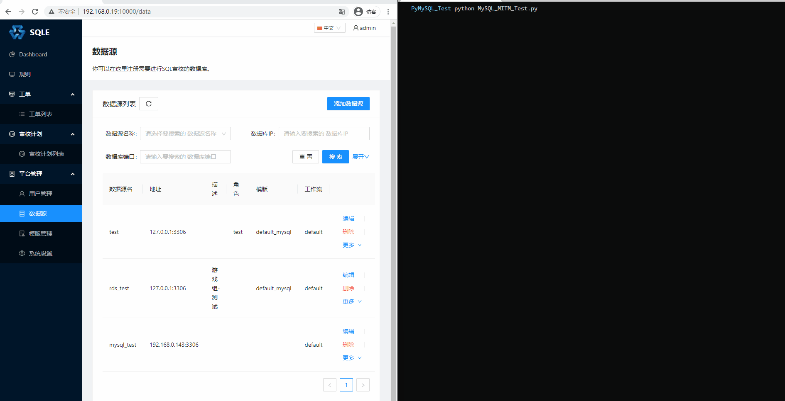

# Fake Mysql Server
## 使用场景
在无法获取服务器上保存的MySQL密码密码时，通过搭建一个假的MySQL服务(类似代理服务器)，劫持会话，实现执行任意SQL的目的。

## 使用方法
1. 修改`pymysql/connections.py`中的监听地址及端口
2. 修改`MySQL_MITM_Test.py`中需要执行的SQL语句
3. 运行`python MySQL_MITM_Test.py`
4. 在目标服务器上连接这个假MySQL服务器

## 演示

